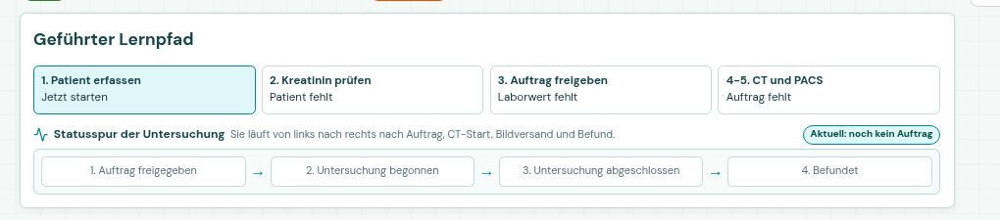
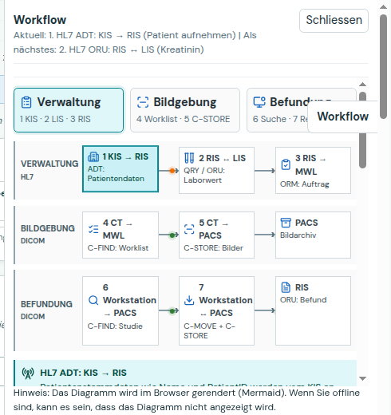

```{=latex}
\begin{learninggoal}
Lernziel: Ihr könnt den Weg eines radiologischen Untersuchungsauftrags von der Patientenaufnahme bis zur Befundung erklären. Dabei könnt ihr die wichtigsten Systeme, Nachrichten und Kennungen einander zuordnen.
\end{learninggoal}
```

# So arbeitet ihr

Öffnet die App: <https://orthanc.bohn-teaching.org>. Verwendet pro Gruppe einen gemeinsamen **Session-Key**.

> **Dashboard zuerst:** Der **Geführte Lernpfad** zeigt euch den nächsten sinnvollen Schritt. Die **Statusspur** zeigt den aktuellen Untersuchungsstatus. Im **Workflow-Panel** seht ihr Sender, Empfänger und Datenfluss.

**Zwei einfache Regeln:**

- **HL7** überträgt hier vor allem Patienten-, Labor-, Auftrags- und Befundinformationen.
- **DICOM** überträgt Bilddaten, bildbezogene Metadaten und stellt Dienste für Suche und Übertragung bereit.

| Rolle | Aufgabe |
|---|---|
| Verwaltung | Schritte 1–3: KIS, LIS und RIS |
| Radiologiefachperson | Schritte 4–5: Worklist, CT und Bildversand |
| Workstation / Befundung | Schritte 6–7: Suche, Retrieve und Befund |
| Beobachtung | Kennungen, Statusspur und Protokoll-Log dokumentieren |

> **Rollenwechsel:** Wechselt nach jedem Checkpoint die sprechende Person. Vor einem wichtigen Klick nennt sie kurz: **System → Aktion/Nachricht → wichtigste Kennung**.

{ width=72% }

## Kennungen-Spickzettel

| Kennung | Entsteht bei | Wo begegnet sie euch wieder? |
|---|---|---|
| `PatientID` | Patientenaufnahme im KIS | LIS, Worklist, DICOM-Tags |
| `AccessionNumber` | radiologischer Auftrag im RIS | Worklist, DICOM-Tags |
| `StudyInstanceUID` | DICOM-Bildstudie | PACS, Retrieve, Befund |

**Zusätzlich:** Eine `SeriesInstanceUID` identifiziert eine Serie innerhalb einer Studie. Eine `SOPInstanceUID` identifiziert ein einzelnes DICOM-Objekt.

## DICOM-Spickzettel

| Befehl | Vereinfacht gesagt |
|---|---|
| `C-ECHO` | Verbindung testen |
| `C-FIND` | Worklist oder Studie suchen |
| `C-STORE` | DICOM-Bilder übertragen |
| `C-MOVE` | Studie aus dem PACS anfordern; die Bilder kommen anschliessend per `C-STORE` |

```{=latex}
\newpage
```

# Checkpoint 1: Patient und Auftrag

**Dashboard-Schritte 1–3: KIS → RIS, RIS ↔ LIS, RIS → Worklist**

1. Erfasst einen Patienten im **KIS**. Öffnet **„KIS erklärt“**.
   - Wer ist Sender, wer Empfänger der ADT-Nachricht?
   - Findet die `PatientID`.

2. Fragt den Kreatininwert beim **LIS** an. Öffnet **„LIS erklärt“**.
   - Welche Kennung verbindet die Laboranfrage mit dem Patienten?
   - Wo steht der gemessene Wert in der Antwort?

3. Gebt den radiologischen Auftrag im **RIS** frei. Öffnet **„RIS erklärt“**.
   - Notiert die `AccessionNumber`.
   - Beobachtet, wie der Auftrag in die Worklist gelangt.

```{=latex}
\begin{tipbox}
Merke: In der Simulation überträgt ADT Patienteninformationen. QRY Q02 fragt einen Laborwert an, ORU R01 liefert ihn zurück und ORM O01 überträgt den radiologischen Auftrag.
\end{tipbox}
```

**Unsere PatientID:** ____________________________________________  

**Unsere AccessionNumber:** _____________________________________  

**Warum braucht die Worklist beide Kennungen?**  
__________________________________________________________________  
__________________________________________________________________

# Checkpoint 2: Worklist und Bildversand

**Dashboard-Schritte 4–5: CT → Worklist, CT → PACS**

1. Öffnet die **CT-Konsole**. Die Modalität fragt die Worklist mit `C-FIND` ab.
2. Findet euren Auftrag wieder. Stimmt die `AccessionNumber` mit Checkpoint 1 überein?
3. Beginnt die Untersuchung und sendet die bereitgestellten anonymisierten DICOM-Bilder mit `C-STORE` an das **PACS**.
4. Öffnet danach **„Tag-Vergleich: Upload und Worklist“**.

```{=latex}
\begin{safetybox}
Patientensicherheit: Stimmen PatientID oder AccessionNumber nicht überein, können Bilder dem falschen Patienten oder dem falschen Auftrag zugeordnet werden. Prüft deshalb die Kennungen, bevor ihr weiterarbeitet.
\end{safetybox}
```

**Worklist gefunden?** [ ] Ja  [ ] Nein  

**`C-STORE` im Protokoll-Log:** [ ] OK  [ ] Fehler  

**Welche Kennungen habt ihr im Tag-Vergleich geprüft?**  
__________________________________________________________________

**Was könnte bei einer falschen `PatientID` oder `AccessionNumber` passieren?**  
__________________________________________________________________  
__________________________________________________________________

```{=latex}
\newpage
```

# Checkpoint 3: PACS und DICOM-Tags

**Nach dem Bildversand: Studie im Archiv prüfen**

Öffnet **PACS (SuS)**. Öffnet eure Studie, anschliessend eine Serie und eine Instanz mit **„Viewer + Tags“**.

| DICOM-Tag | Wert in eurer Studie | Passt zu eurem Fall? |
|---|---|---|
| `PatientID` | | [ ] Ja  [ ] Nein |
| `AccessionNumber` | | [ ] Ja  [ ] Nein |
| `StudyInstanceUID` | | [ ] Ja  [ ] Nein |
| `Modality` | | [ ] Ja  [ ] Nein |

> **Tipp:** `PatientID` und `AccessionNumber` verbinden die Bilddaten mit Patient und Auftrag. Die `StudyInstanceUID` identifiziert die gesamte Bildstudie eindeutig.

**Welche der vier Kennungen ist für die eindeutige Identifikation der Studie entscheidend?**  
__________________________________________________________________

# Checkpoint 4: Suche, Retrieve und Befund

**Dashboard-Schritte 6–7: Workstation → PACS → Workstation → RIS**

1. Öffnet die **Workstation**. Sie sucht eure Studie mit `C-FIND` im PACS.
2. Fordert die Studie mit `C-MOVE` an.
3. Öffnet im Workflow-Panel die **Rückkanal-Animation** und erklärt beide Richtungen:
   - Workstation → PACS
   - PACS → Workstation
4. Erstellt einen kurzen Befund und sendet ihn. Prüft anschliessend, wo er im **RIS** erscheint.

{ width=50% }

**`C-MOVE` bedeutet in diesem Ablauf:**  
__________________________________________________________________  
__________________________________________________________________

**Warum erscheint danach zusätzlich `C-STORE` im Rückkanal?**  
__________________________________________________________________  
__________________________________________________________________

**Wo erscheint der Befund nach dem Senden?**  
__________________________________________________________________

```{=latex}
\newpage
```

# Checkpoint 5: Fehler finden

Wählt **einen** Fehlerfall im Dashboard und versucht, die Ursache systematisch einzugrenzen:

- **`C-ECHO` fehlgeschlagen:** Simuliert einen falschen Port.
- **Worklist leer:** Prüft Patient, freigegebenen RIS-Auftrag, `AccessionNumber` und Session-/SuS-Code.
- **`C-MOVE` ohne Empfang:** Prüft Verbindung, Ziel-AE und Rückkanal.

Beantwortet gemeinsam:

1. **Welche Verbindung ist im Workflow-Panel unterbrochen?**  
   ________________________________________________________________

2. **Welche Prüfung macht ihr als Erstes – und warum?**  
   ________________________________________________________________  
   ________________________________________________________________

3. **Welcher DICOM-Befehl eignet sich als einfacher Verbindungstest?**  
   ________________________________________________________________

4. Prüft danach nochmals **Geführten Lernpfad** und **Statusspur**. Ist der Workflow wieder vollständig? [ ] Ja  [ ] Nein

```{=latex}
\newpage
```

# Gruppenfazit

Beantwortet die drei Fragen möglichst konkret mit einem Beispiel aus eurem Fall.

**Der wichtigste Datenübergabepunkt war:**  
__________________________________________________________________  
__________________________________________________________________

**Das hat uns vor einer Fehlzuordnung geschützt:**  
__________________________________________________________________  
__________________________________________________________________

**Einen Zusammenhang können wir jetzt erklären:**  
__________________________________________________________________  
__________________________________________________________________

**Abschluss:** Nutzt das Quiz am Ende des Dashboards als Selbstcheck. Vergleicht anschliessend eure Antworten in der Gruppe.
